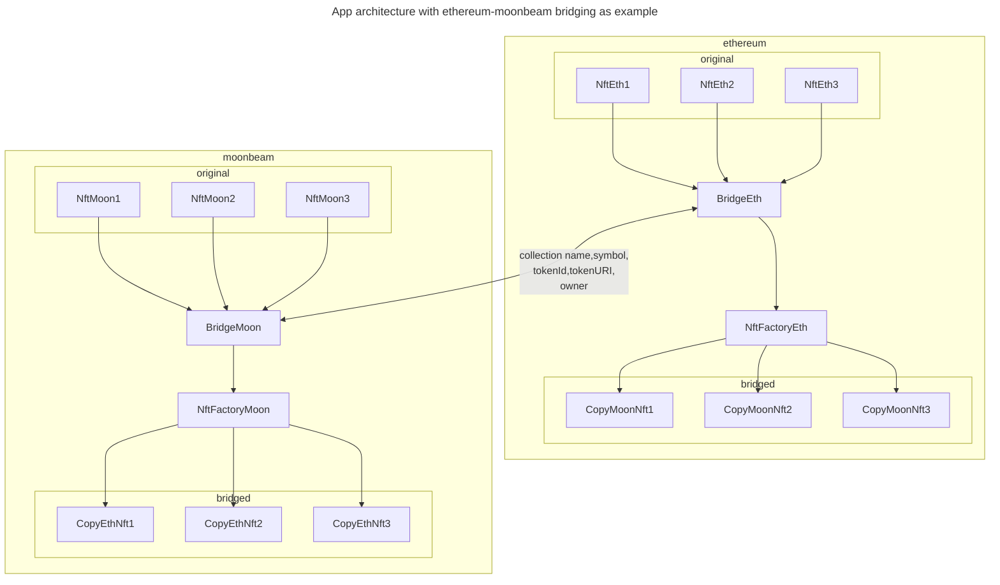
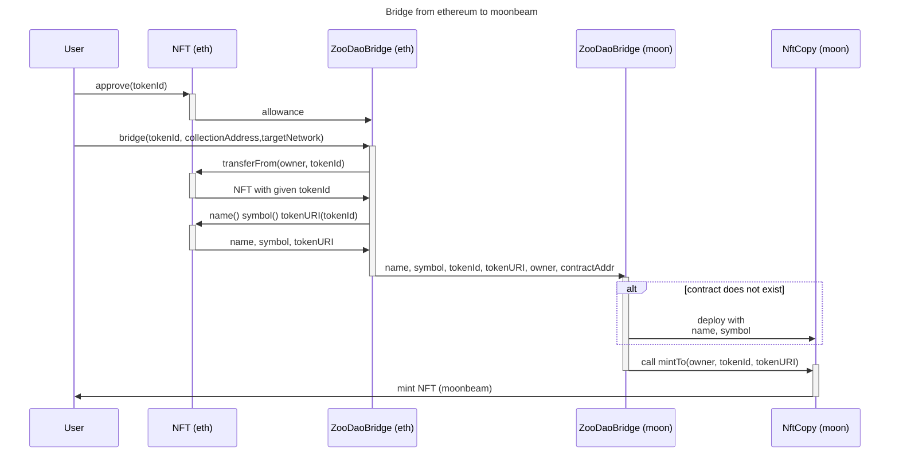

# Mirror - NFT Bridge

This repository is about developing contracts to make easier bridging NFTs from ethereum network to moonbeam for ZooDAO Dapp users and devs

## Problems to solve

1. Most popular collections are located on Ethereum network, but our first version of dapp is one Moonbeam
2. Wormhole used to bridge seems to be hard to use for devs and users (vision responsible's assumption)
3. Bridged NFTs on moonbeam must be assigned to different contracts to veZoo to be able to work properly
4. We might want to use moonbeam original collections on arbitrum, then we should use many-to-many networks bridge architecture
5. **Bridge only eligible collections** (eligible for bridging is nothing to do with eligibility to stake in dapp)

## Architecture considerations

1. Use one bridging contract (like proxy ONFT) on ethereum for multiple NFT contracts to save gas
2. Use multiple contracts on moonbeam to work with veZoo. For every new collection bridged with our solution - deploy new NFT (ONFT) contract on moonbeam and mint NFTs there.
3. Bridge one/multiple tokens at a time?
4. Make ONFT collection contracts on moonbeam to store URI for every token (StorageURI OZ contract) - it will allow most contracts to be bridgable with this architecture. Token URI will be passed and stored during bridge.

## Achitecture

## Example flow

## Future

In future this app is going to be used by multiple networks and bridge should work as many-to-many. Route like first ever bridge from ethereum to moonbeam, from moonbeam to arbitrum, from arbitrum back to ethereum. Complex routes with additional networks should be available.

## Multi-chain technology

Communication between Bridge contracts is realized with **LayerZero** technology as trustless and most simple solution.
