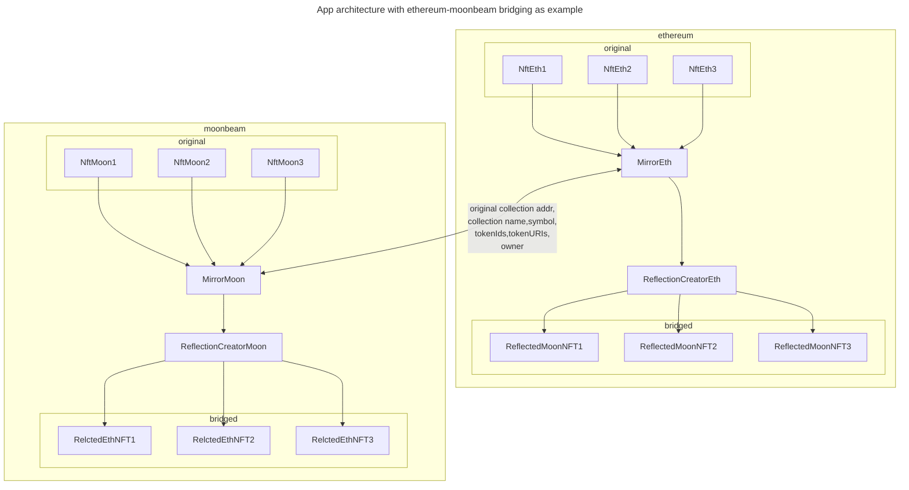

# Mirror - NFT Bridge

Mirror - is the system of smart contracts that allows any (eligible) collection on any EVM-compatible network to be bridged to any other EVM network in one transaction.


It is developed to allow any non-omnichain NFT collection to be bridged between networks without deploying ProxyONFT for every single collection. Mirror - is the single Proxy contract for all the existing collections!

## Bridge process

It works like following:

1. lock original NFT on contract
2. Create copy contract (ReflectedNFT contract) on target chain with same name and symbols (if there is no contract for that collection)
3. Mint copy of original NFT with the same tokenId and tokenURI to owner address.

## Bridging reflection

NFT-reflection can be bridged further to different chains without any limitations - copy will be burned and new copy will be minted on target chain.

## Returning original NFT

When user want to return back his original NFT the process will be as follows:

1. Bridge NFT from current chain back to original
2. NFT-reflection will be burned
3. On the target chain original NFT will be unlocked from contract and transferred to owner

## Problems to solve

1. Most popular collections are located on Ethereum network, but first version of ZooDAO DApp is on Moonbeam
2. Wormhole seems to be hard to use for devs and users to bridge NFTs
3. Bridged NFTs on moonbeam must be assigned to different contracts to veZoo to be able to work properly
4. We might want to use moonbeam original collections on arbitrum, then we should use many-to-many networks bridge architecture
5. **Bridge only eligible collections** - approved by admin (eligible for bridging is nothing to do with eligibility to stake in ZooDAO DApp)

## Architecture considerations

1. Use one bridging contract on ethereum for multiple NFT contracts to save gas. Like ProxyOFT, but for multiple collections
2. Use separate contracts for reflected collections to work with veModel (veZoo) in ZooDAO NFT Battle Arena. For every new collection bridged using Mirror - deploy new NFT contract on target chain and mint NFTs there.
3. Bridge multiple NFTs at a time
4. Mint NFTs with same tokenIds and tokenURIs as on source chain. Use StorageURI OZ contract to allow most of collections to be compatible with bridge logic.
5. Take fee on bridge
6. Use original collection address as a unique identifier between networks. Original collection address is passed with every bridge message to help identify the moment when NFT will be returned to original chain and should be unlocked.

## Achitecture



## Omnichain technology

Communication between Mirror contracts is implemented with [**LayerZero**](https://layerzero.network/) as trustless and most simple solution.

## Integration

### Bridge NFT

1. approve() NFT to Mirror contract address
2. Get eth value to send via
    1. _estimateSendFee() -_ for signle NFT
    2. _estimateSendBatchFee() - for multiple NFTs_
3. Call _createReflection()_ with eth value got from _estimateSendFee()_
    1. targetNetworkId - is the ID of network in LZ ecosystem, it differs from chain ID
    2. zroPaymentAddress - must be zero address
    3. adapterParams - bytes array containing version of LZ protocol (default - 1) and gasLimit for tx on target chain more on adapterParams below

```Solidity
function createReflection(
		address collectionAddr,
		uint256[] memory tokenIds,
		uint16 targetNetworkId,
		address payable _refundAddress,
		address _zroPaymentAddress,
		bytes memory _adapterParams
	) public payable {
```

### adapterParams

```TypeScript
const RecommendedGas = 2000000 + 100000 * tokenIds.length // gas limit for contract deployment and mint
const adapterParams = ethers.utils.solidityPack(['uint16', 'uint256'], [1, RecommendedGas])
```
